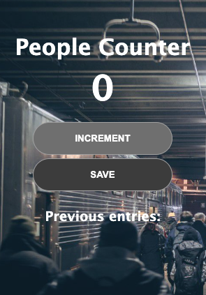

# People Counter

## Description

A small app that allows the user to log the number of people that they count at a time.

In building and deploying this app, I learnt about the learning platform [Scrimba](https://scrimba.com/), how to connect HTML with JavaScript, and deploying apps with [Netlify](https://www.netlify.com/). Specifically, I learnt about "The DOM" (Document Object Model), that is, how to use JavaScript to change the website, e.g. using`getElementById()` and the `.innerText` and `.textContent` properties.

## Usage

The app can be accessed and used through a web browser at the address below.

https://luminous-fox-1b8473.netlify.app/

Clicking on the 'increment' button will increment the counter by 1, and then clicking on the 'save' button will log the counter number below and also reset the counter.

A screenshot of how the app should look on a suitably sized screen is shown below.

